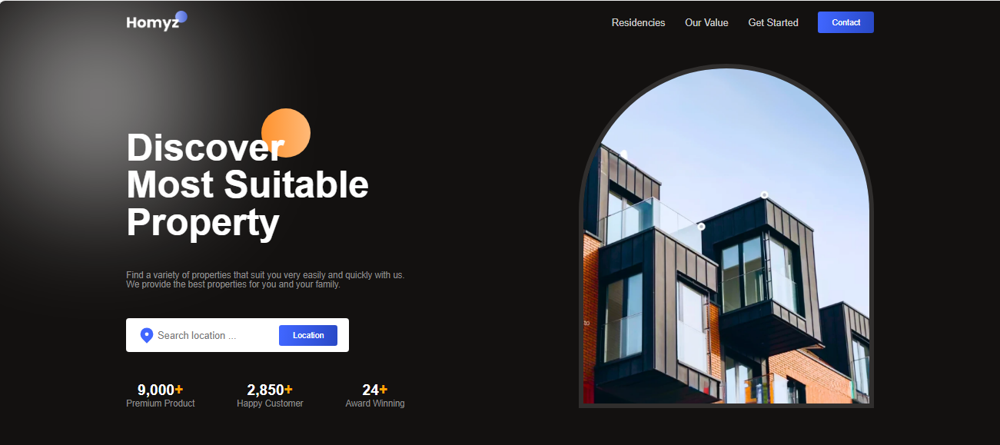
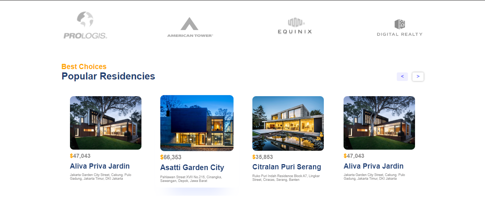
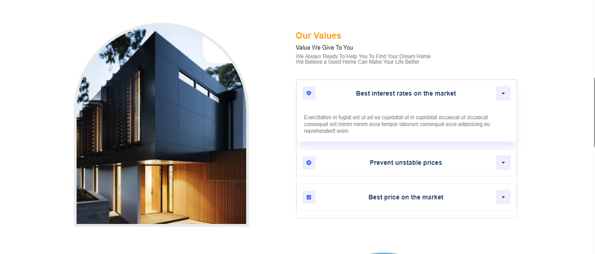
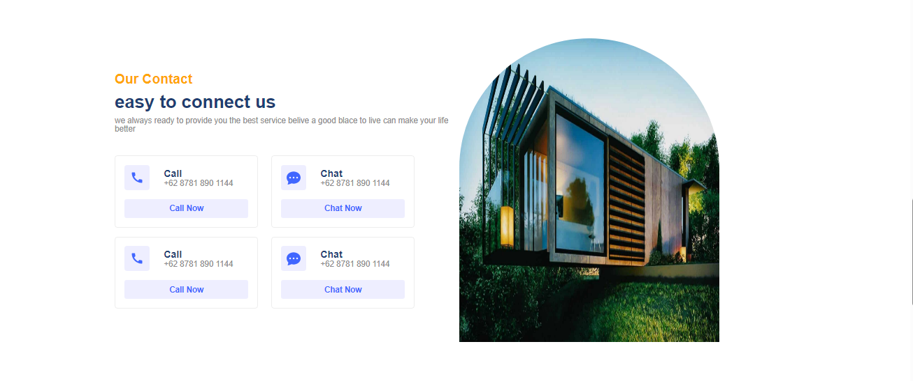

# Real Estate Company Profile

This project is a company profile website for a real estate company specializing in hotel booking and property sales. The web application is built using Vite.js and managed with Yarn.

## Getting Started

To run the project locally, follow these steps:

1. Clone the repository:

   ```bash
   git clone [https://github.com/arimaulanahardan/SimpleWeb-Properti]
   ```

2. Navigate to the project directory:

   ```bash
   cd SimpleWeb-Properti
   ```

3. Install dependencies:

   ```bash
   yarn i
   ```

4. Run the development server:

   ```bash
   yarn run dev
   ```

   This will start the development server, and you can view the application at `http://localhost:3000`.

## Scripts

- `yarn dev`: Start the development server.
- `yarn build`: Build the production-ready application.
- `yarn preview`: Preview the production build locally.

## Dependencies

- [framer-motion](https://www.npmjs.com/package/framer-motion) - Animations library.
- [react](https://reactjs.org/) - JavaScript library for building user interfaces.
- [react-accessible-accordion](https://www.npmjs.com/package/react-accessible-accordion) - Accessible accordion component for React.
- [react-countup](https://www.npmjs.com/package/react-countup) - React component wrapper around CountUp.js.
- [react-dom](https://reactjs.org/docs/react-dom.html) - Entry point to the DOM and server renderers for React.
- [react-icons](https://react-icons.github.io/react-icons/) - Icon library for React applications.
- [react-outside-click-handler](https://www.npmjs.com/package/react-outside-click-handler) - React component to handle clicks outside a specified area.
- [swiper](https://swiperjs.com/) - Modern mobile touch slider.

## Project Structure

- **`app.tsx`**: The main entry point of the application.
- **`components/`**: Directory containing different sections of the company profile (Header, Hero, Companies, Residencies, Value, Contact, GetStarted, Footer).
- **`App.css`**: Stylesheet for the main application.

## Usage

The `App` component in `app.tsx` represents the structure of the entire company profile. Each section is modularized into separate components for better organization and maintainability.

Feel free to customize the content, styles, and components to fit the specific needs and branding of the real estate company.

## Screen Shoot Project





